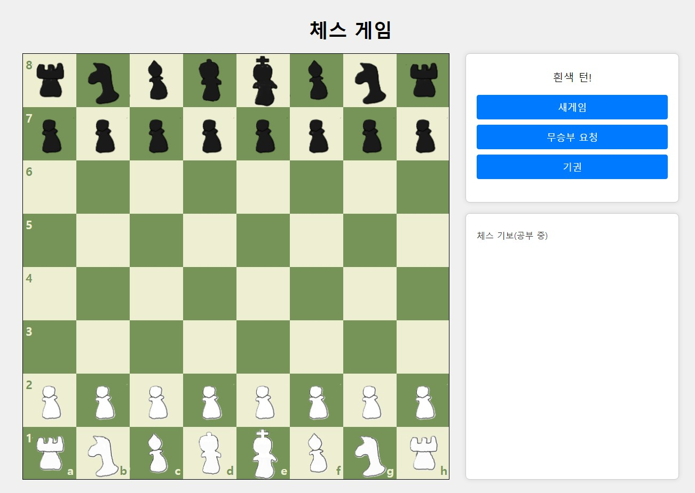

# 체스 게임

체스하러가기 : https://pukkok.github.io/chess

  
## 날짜별 업데이트 내용
<BlockQuote>6/28</BlockQuote>
 
1. 그림판으로 체스말 PNG파일 만들기
2. 체스판(ChessBoard.js) 브라우저로 구현

<BlockQuote>6/29</BlockQuote>

1. Pawn, Knight 움직이는 규칙 구현

<BlockQuote>7/1</BlockQuote>

1. 나머지 체스 말 움직이는 규칙 구현
2. 체크메이트 동작 구현

<BlockQuote>7/4</BlockQuote>

1. 특수 규칙 추가
 - 앙파상 구현
 - 프로모션 구현

## 추가 구현 필요 사항

1. 캐슬링 구현하기
2. 기보 구현하기
3. ...
